# eventHub — Berlin Events Ticketing Platform

A MERN app for discovering and booking Berlin events: concerts, theatre, sports, conferences, and nightlife. Three roles (Standard User, Organiser, System Admin), multi-tier tickets, theatre seat selection, and an organiser analytics dashboard.

## Overview

Visitors browse events by category, pick tickets from one or more price tiers, or choose specific seats for theatre shows. Organisers create their own events and see how each one is selling. Admins approve events before they go public and manage users from a single page.

Payment processing is not integrated yet — bookings are stored in the database but no money moves. A seed script creates an admin account so you can sign in and try every role on first run.

## Screenshots

### Home

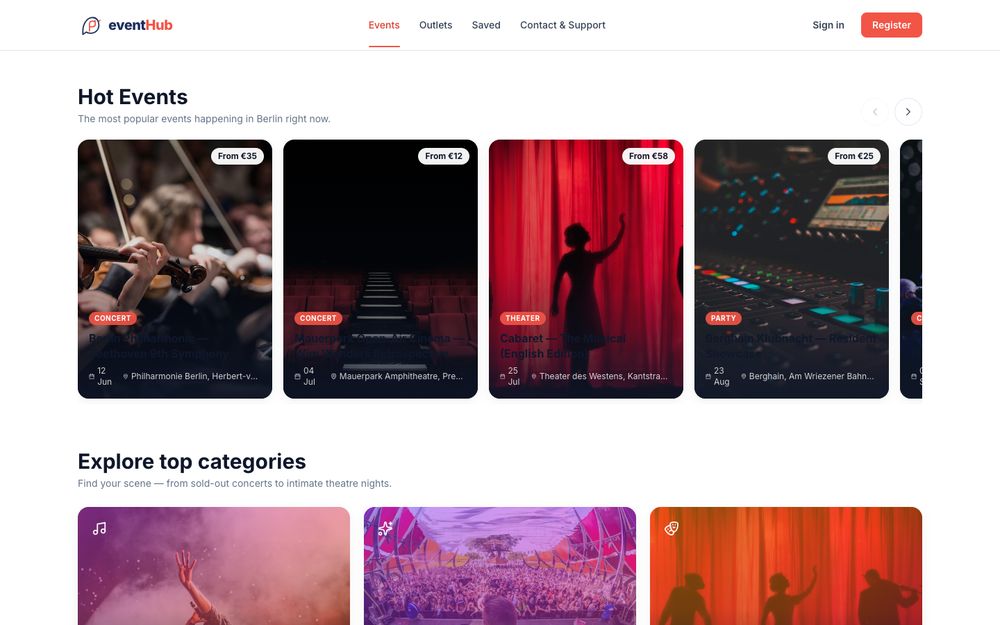

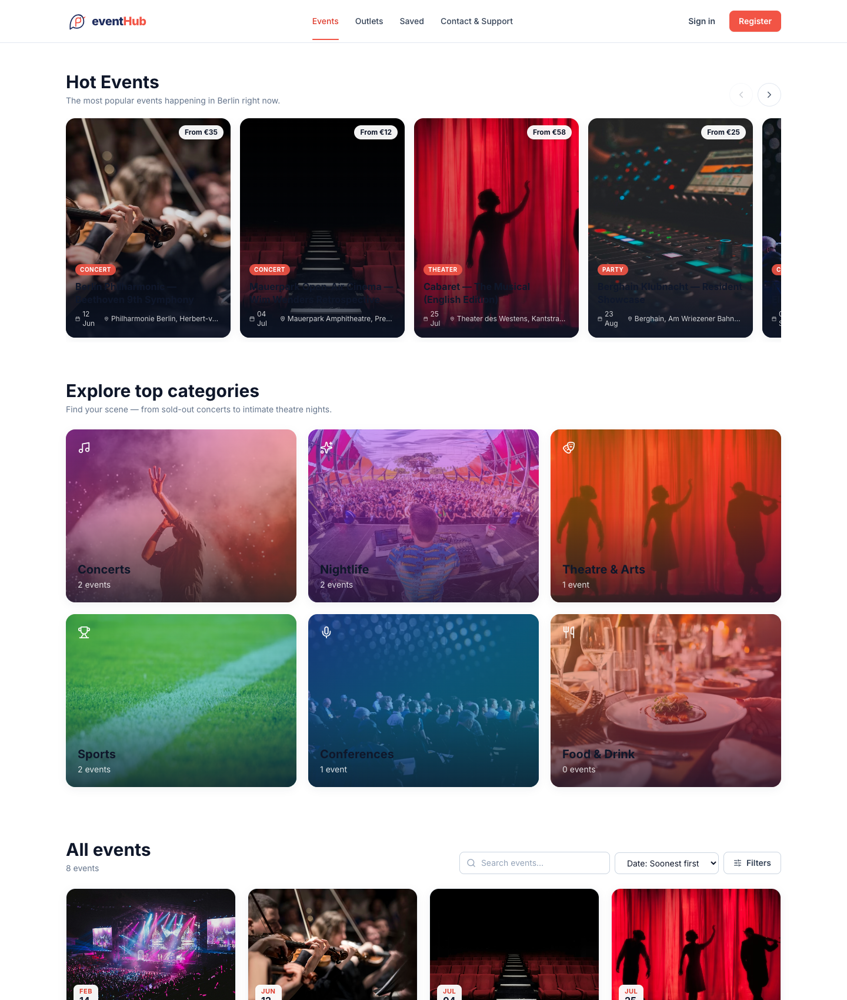

### Event details

Each event page shows the description, organiser, date and venue, and a side panel with every ticket tier and a checkout button.

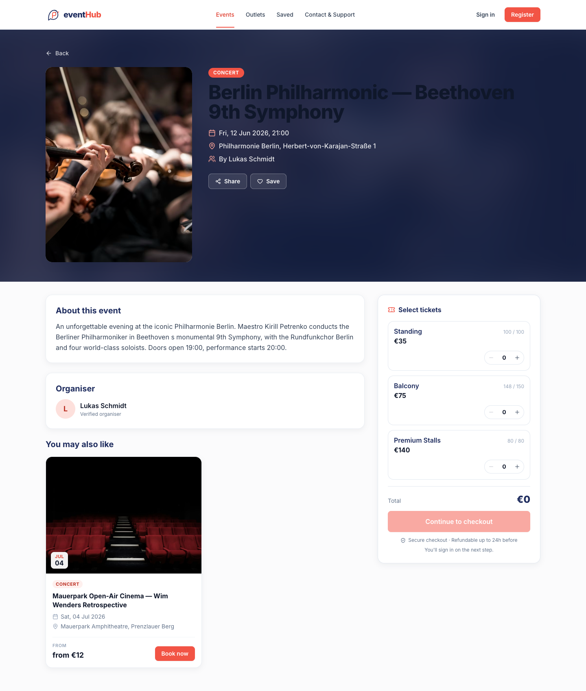

### Multi-tier ticket selector

Each event lists every ticket tier with its own price and remaining count.

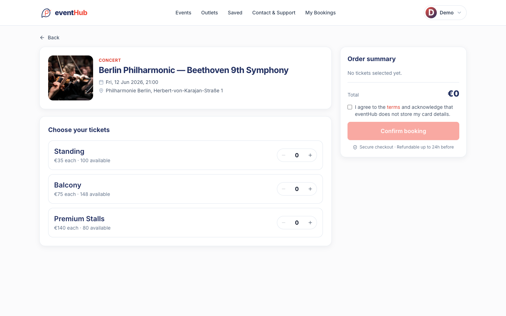

### Theatre seat picker

Theatre events render a seat grid. The server prevents two users from picking the same seat.

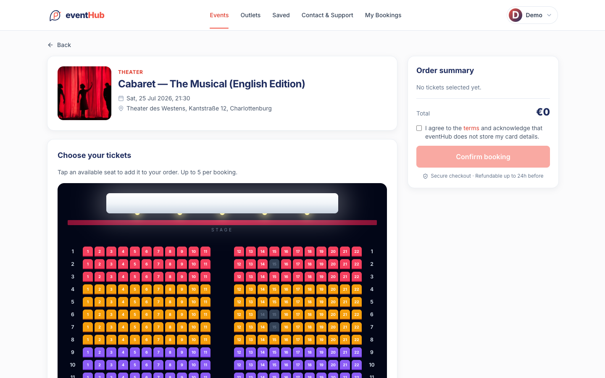

### Organiser analytics

KPIs (events, total tickets, sold, revenue), a per-event "% booked" bar chart, and a sold-vs-available donut.

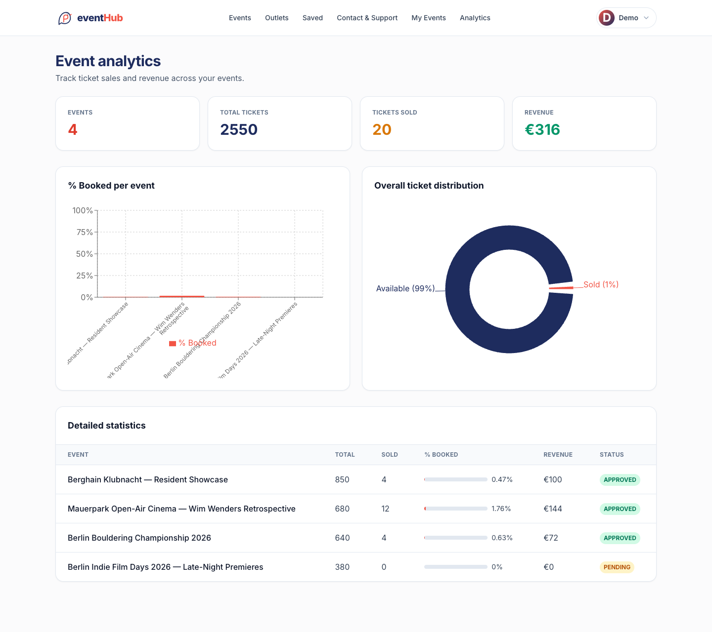

### Organiser — my events

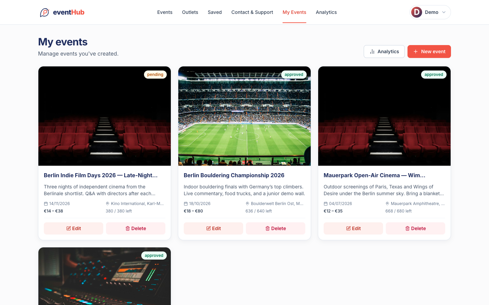

### Admin — event queue

Approve, decline, or remove events. Filter pills for All / Pending / Approved / Declined.

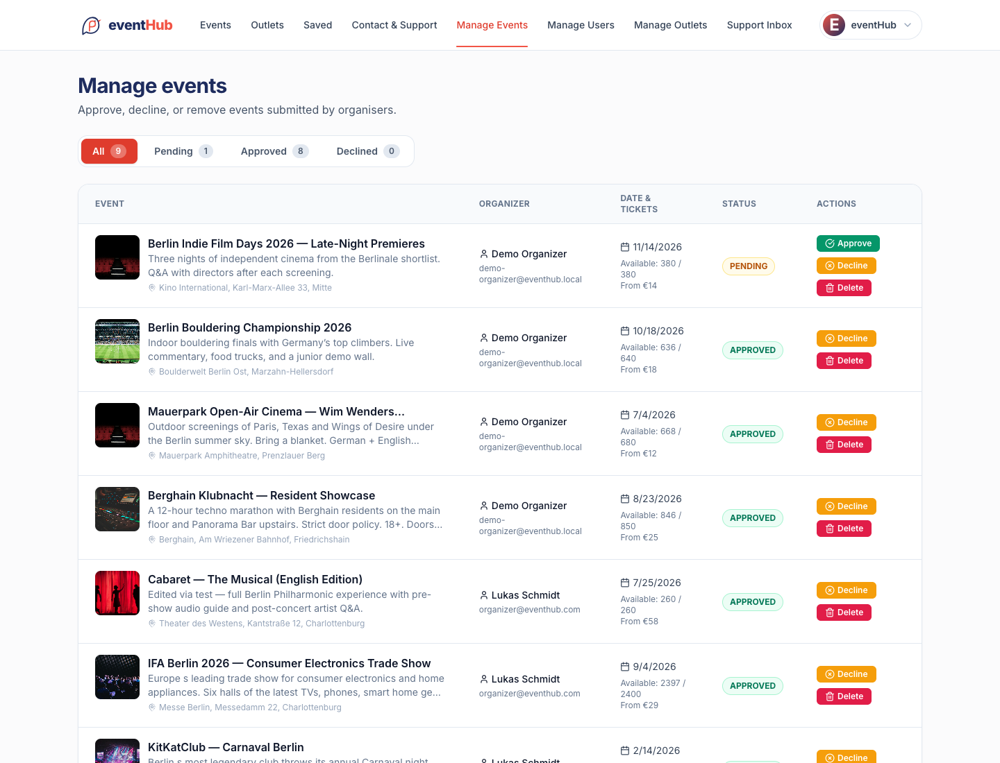

### Admin — user management

Search users, change roles, delete accounts. The current admin row is locked to prevent self-demotion.

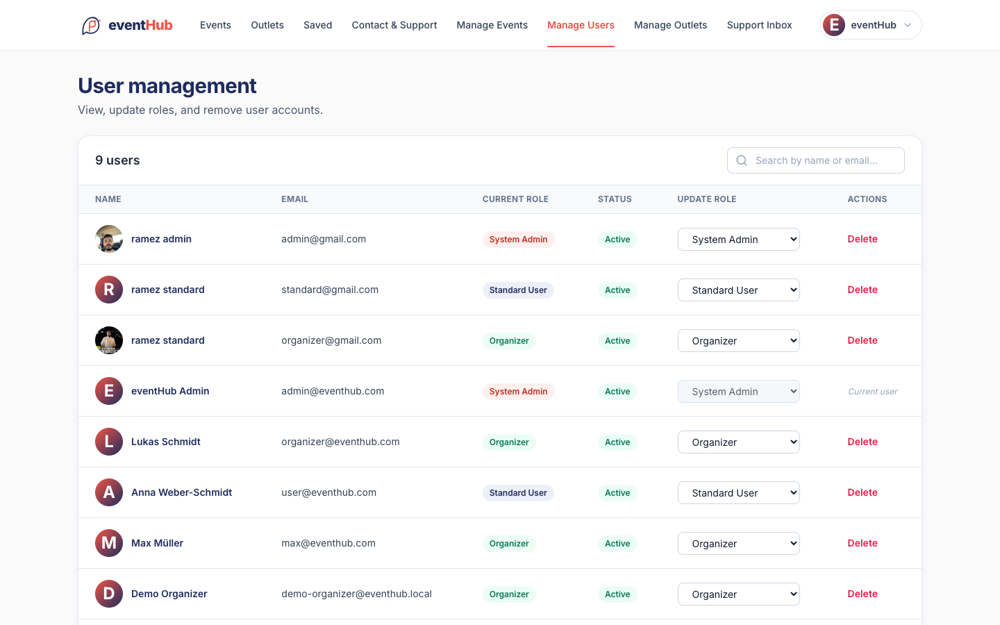

### Outlets

Public directory of physical pickup points across Berlin.

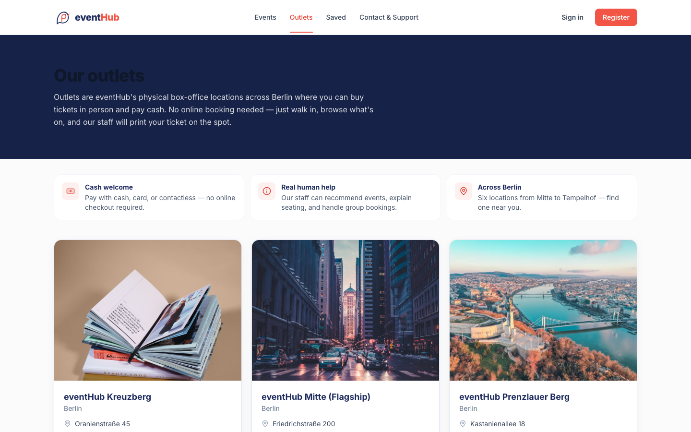

### Auth

Sign in (left) and the OTP-based forgot-password flow (right).

| Sign in | Reset password |
|---|---|
| 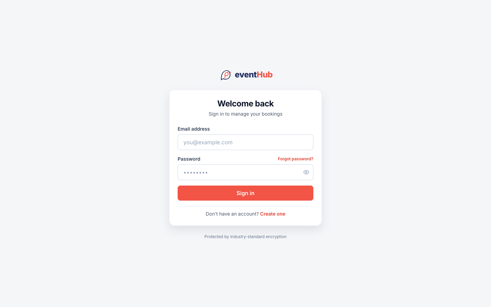 | 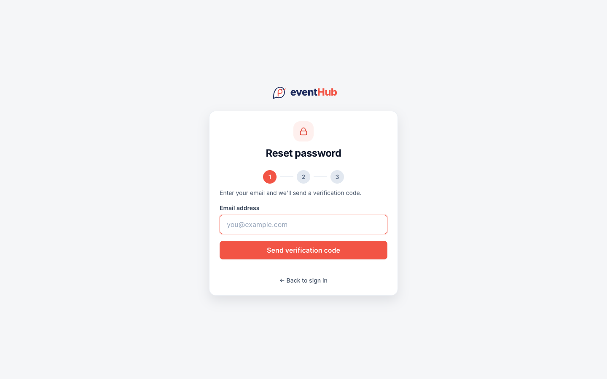 |

## Features

### Visitor

- Browse approved events with debounced search across title, description, location, and date range
- Filter by category
- Per-tier availability with "Sold out" / "Only N left" indicators
- Book multiple tiers in one request
- Pick specific seats for theatre events
- Cancel a booking — tickets go back into inventory
- Save events to a wishlist

### Organiser

- Create events with category-specific custom fields (concert lineup, sports teams, conference speakers, etc.)
- Edit date, location, and ticket counts (edits re-enter the admin queue)
- Per-event analytics with bar and donut charts
- Delete own events

### Admin

- View every event with status filters
- Approve, decline, or delete any event
- Manage users — view, change role, delete
- Manage outlets and triage contact-form messages

### Auth

- JWT in an httpOnly cookie, 7-day session
- Bcrypt password hashing (10 rounds)
- OTP-based password reset (3-step wizard, SHA-256 hashed code, 10-min TTL, 5-attempt lockout)
- Rate-limited login / register / password-reset (50 requests per 15 minutes)
- Helmet, CORS allowlist, role-aware route protection with intended-URL preservation

## Tech Stack

| Layer | Stack |
|---|---|
| Frontend | React 18 (Vite), React Router 6, Tailwind CSS, Axios, Recharts, Chart.js, react-toastify, Lucide |
| Backend | Node.js, Express 4, Mongoose 7 |
| Database | MongoDB (local or Atlas) |
| Auth & security | JWT, bcrypt, Helmet, express-rate-limit, cookie-parser |
| Email | Nodemailer (with a dev-mode console fallback) |
| Tooling | ESLint, Nodemon, dotenv |

## Implementation notes

- **Per-tier inventory.** Each ticket tier tracks its own remaining count, and bookings update those counts in a single database operation so totals stay accurate.
- **Seat-conflict prevention.** When a user picks seats for a theatre event, the server checks they aren't already taken before saving. Two users clicking "Confirm" at the same time can't end up with the same seat — the second request is rejected.
- **OTP password reset.** Reset codes are 6 digits, hashed before being stored, expire after 10 minutes, and lock out after 5 wrong attempts.
- **Client-side image compression.** Profile pictures and event posters are resized and compressed in the browser before upload.

## Project Structure

```
events-ticketing-system-berlin/
├── backend/
│   ├── Controller/         bookingController, eventcontroller, userController, outletController, contactController
│   ├── Middleware/         authentication, authorization, errorHandler
│   ├── Model/              UserSchema, EventSchema, BookingSchema, OutletSchema, ContactMessageSchema
│   ├── Routes/             auth, user, eventroute, bookingroute, outletroute, contactroute
│   ├── utils/              email (nodemailer), categoryFields
│   ├── scripts/            seed-test-data.js
│   ├── app.js
│   └── .env.example
├── frontend/
│   ├── src/
│   │   ├── auth/           AuthContext, ProtectedRoutes
│   │   ├── components/     Navbar, Footer, EventCard, EventList, TheaterSeating, TicketSelectionPanel, ...
│   │   ├── components/ui/  Loader, ConfirmDialog, EmptyState
│   │   ├── pages/          Home, EventDetails, Booking, MyBookings, MyEvents, EventAnalytics, Admin*, Outlets, ...
│   │   ├── services/api.js
│   │   ├── App.jsx
│   │   └── main.jsx
│   ├── tailwind.config.js
│   ├── vite.config.js
│   └── .env.example
├── docs/screenshots/
└── README.md
```

## Getting Started

### Prerequisites

- Node.js 18+
- MongoDB running on port 27017 (or an Atlas connection string)

### Backend

```bash
cd backend
cp .env.example .env
npm install
node scripts/seed-test-data.js   # creates the admin account
npm run dev                      # http://localhost:3000
```

Health check: `GET http://localhost:3000/api/v1/health`.

### Frontend (in a new shell)

```bash
cd frontend
cp .env.example .env
npm install
npm run dev                      # http://localhost:5173
```

### Test credentials

| Role | Email | Password |
|---|---|---|
| System Admin | `admin@eventhub.com` | `Admin@2026` |

Register a Standard User or Organiser from the sign-up form to try the other roles.

## Environment Variables

### Backend (`backend/.env`)

The three you actually need to know about:

| Variable | What it is | Default |
|---|---|---|
| `PORT` | Port the API runs on | `3000` |
| `MONGO_URI` | Where to connect to MongoDB | `mongodb://localhost:27017/EventBooking` |
| `JWT_SECRET` | Random string used to sign session tokens | set anything for local dev |

Email, CORS, and OTP timing settings have working defaults in [`backend/.env.example`](backend/.env.example) — leave them alone for local dev.

### Frontend (`frontend/.env`)

| Variable | Description | Default |
|---|---|---|
| `VITE_API_BASE_URL` | Backend base URL | `http://localhost:3000/api/v1` |

Full set with comments: [`backend/.env.example`](backend/.env.example), [`frontend/.env.example`](frontend/.env.example).

## API Reference

<details>
<summary>Click to expand the full route list</summary>

All routes are mounted under `/api/v1`.

#### Auth (public)

| Method | Path | Description |
|---|---|---|
| POST | `/register` | Register a new user |
| POST | `/login` | Authenticate and set JWT cookie |
| POST | `/logout` | Clear JWT cookie |
| POST | `/forgetPassword/request` | Request OTP for password reset |
| POST | `/forgetPassword/verify` | Verify OTP, get reset token |
| PUT  | `/forgetPassword` | Reset password (single-call or reset-token) |

#### Users

| Method | Path | Access | Description |
|---|---|---|---|
| GET | `/users` | Admin | List all users |
| GET | `/users/profile` | Auth | Current profile |
| PUT | `/users/profile` | Auth | Update profile |
| DELETE | `/users/profile` | Auth | Self-delete |
| PUT | `/users/changePassword` | Auth | Change own password |
| GET | `/users/:id` | Admin | Single user |
| PUT | `/users/:id` | Admin | Update role |
| DELETE | `/users/:id` | Admin | Delete user |
| GET | `/users/bookings` | Standard User | Own bookings |
| GET | `/users/events` | Organiser | Own events |
| GET | `/users/events/analytics` | Organiser | Per-event analytics |

#### Events

| Method | Path | Access | Description |
|---|---|---|---|
| GET | `/events` | Public | List approved events |
| GET | `/events/all` | Admin | List all events (any status) |
| GET | `/events/:id` | Public | Single event |
| POST | `/events` | Organiser | Create event (defaults to `pending`) |
| PUT | `/events/:id` | Organiser / Admin | Update event |
| DELETE | `/events/:id` | Organiser / Admin | Delete event |
| PUT | `/events/:id/status` | Admin | Update status |
| PUT | `/events/:id/approve` | Admin | Set status to `approved` |
| PUT | `/events/:id/decline` | Admin | Set status to `declined` |

#### Bookings

| Method | Path | Access | Description |
|---|---|---|---|
| POST | `/bookings` | Standard User | Create booking |
| GET | `/bookings/:id` | Standard User | Own booking detail |
| DELETE | `/bookings/:id` | Standard User | Cancel booking |
| GET | `/bookings/event/:eventId` | Auth | Booked seats for an event (theatre seat picker) |

#### Outlets

| Method | Path | Access | Description |
|---|---|---|---|
| GET | `/outlets` | Public | List active outlets |
| GET | `/outlets/:id` | Public | Single outlet |
| POST | `/outlets` | Admin | Create outlet |
| PUT | `/outlets/:id` | Admin | Update outlet |
| DELETE | `/outlets/:id` | Admin | Remove outlet |

</details>

## Future Improvements

- Stripe / Adyen integration for actual payment
- Public deployment (Render + Atlas + Vercel)


## Contact

- GitHub: [@RamezMilad-1](https://github.com/RamezMilad-1)
- LinkedIn: https://www.linkedin.com/in/ramez-milad-76837a282
- Email: ramezmilad19@gmail.com
